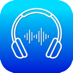
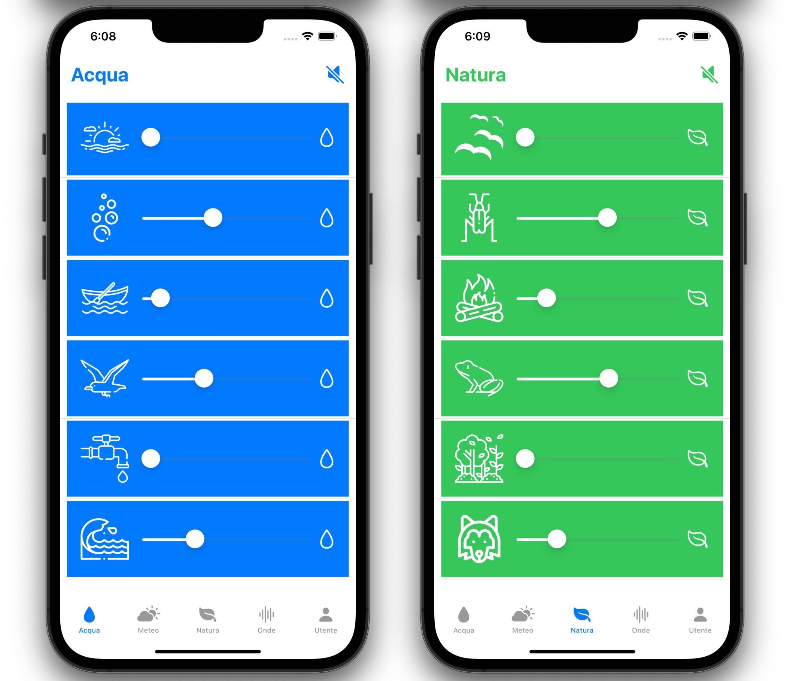
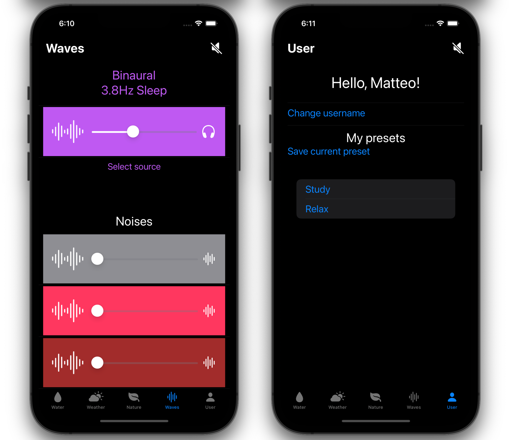

    
    <h1>atmos</h1>

iOS application developed using Swift, SwiftUI and <a href="https://github.com/AudioKit/AudioKit">AudioKit</a> for Mobile Programming course, Università della Calabria, AA 2020/2021.

Users can customize the background sound by changing the volume of the different sources.  
They can choose from a variety of sounds divided in three categories: water, weather and nature.  
Moreover, six different kinds of binaural beats and white, pink and brown noises can be played.  
Users can create and delete their custom presets to load whenever they want, with custom names.
The application supports English and Italian languages, light and dark themes.

---

    <h2>Previews:</h2>
    
    

